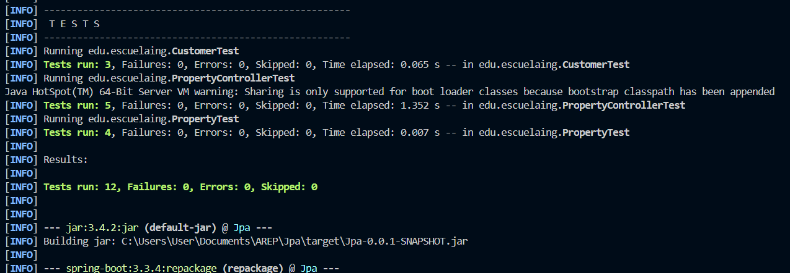
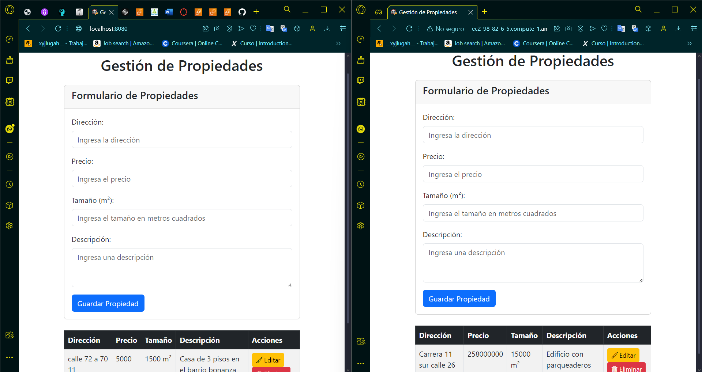
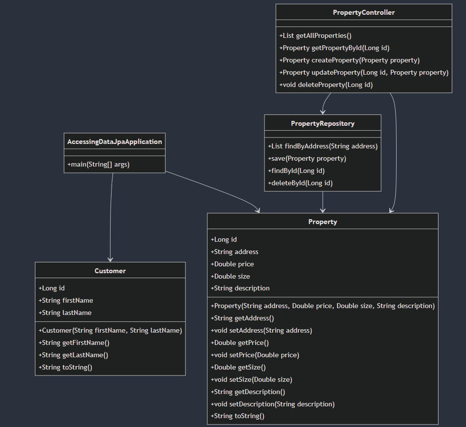

# Property Management System with Spring Boot and MySQL

This project is a property management system built with Spring Boot and MySQL. It allows users to manage properties by creating, reading, updating, and deleting (CRUD) properties using a REST API. The backend uses Spring Boot with JPA for database interaction, and the frontend is built with HTML and JavaScript.

## Features

- **Property Management:** Create, read, update, and delete properties stored in a MySQL database.
- **RESTful API:** Exposes endpoints for managing properties through HTTP methods.
- **CRUD Operations:** Full support for CRUD operations on property data.

## Getting Started

To get a local copy up and running, follow these simple steps.

### Prerequisites

Make sure you have the following installed:
- Java Development Kit (JDK)
- Maven
- Git
- MySQL (or any MySQL-compatible database)

## Main Classes Explained

### 1. `AccessingDataJpaApplication.java`

This is the main entry point of the Spring Boot application. It starts the application and initializes the Spring context.

- **`main(String[] args)`**: Starts the Spring Boot application.

### 2. `Customer.java`

Entity class representing a customer in the system. This is a simple JPA entity mapped to a table in the database.

- **`Customer(String firstName, String lastName)`**: Constructor to initialize a new customer with a first name and last name.
- **`getId()`**: Returns the unique ID of the customer.
- **`getFirstName()`**: Returns the first name of the customer.
- **`getLastName()`**: Returns the last name of the customer.

### 3. `Property.java`

Entity class representing a property. Each property has attributes such as address, price, size, and description.

- **`Property(String address, Double price, Double size, String description)`**: Constructor to create a new property.
- **`getAddress()`**: Returns the address of the property.
- **`getPrice()`**: Returns the price of the property.
- **`getSize()`**: Returns the size of the property.
- **`getDescription()`**: Returns the description of the property.

### 4. `PropertyController.java`

REST controller class that handles HTTP requests related to properties. It provides CRUD functionality through the following endpoints:

- **`/properties`**: GET endpoint to retrieve all properties.
- **`/properties/{id}`**: GET endpoint to retrieve a property by ID.
- **`/properties`**: POST endpoint to create a new property.
- **`/properties/{id}`**: PUT endpoint to update an existing property.
- **`/properties/{id}`**: DELETE endpoint to delete a property.

### 5. `PropertyRepository.java`

This interface extends `CrudRepository` and handles database operations for `Property` entities. It provides standard CRUD operations and also defines a custom method to find properties by their address.

- **`findByAddress(String address)`**: Returns a list of properties that match the specified address.

### Setting Up and Connecting the MySQL Database with Docker

To easily set up a MySQL database for the Property Management System, you can use Docker to run a MySQL container. This section explains how to create a MySQL container, configure the Spring Boot application to connect to it, and ensure the system works seamlessly with Docker.

#### Step 1: Run MySQL in Docker

You can run a MySQL database in a Docker container using the following command:

```bash
docker run --name mysql-container \
    -e MYSQL_ROOT_PASSWORD=root \
    -e MYSQL_DATABASE=mydatabase \
    -e MYSQL_USER=user \
    -e MYSQL_PASSWORD=password \
    -p 3306:3306 \
    -d mysql:8.0
```

Explanation of the command:
- `--name mysql-container`: Names the container "mysql-container".
- `-e MYSQL_ROOT_PASSWORD=root`: Sets the MySQL root password to `root`.
- `-e MYSQL_DATABASE=mydatabase`: Creates a database called `mydatabase`.
- `-e MYSQL_USER=user`: Creates a user called `user`.
- `-e MYSQL_PASSWORD=password`: Sets the password for the `user` to `password`.
- `-p 3306:3306`: Exposes MySQL on port `3306` so that it can be accessed from outside the container.
- `-d mysql:8.0`: Specifies the version of MySQL (8.0) to run.

#### Step 2: Configure Spring Boot to Connect to the Docker MySQL Database

After running the Docker container, configure the Spring Boot application to connect to the MySQL instance using the settings in the `application.properties` file.

Add the following configuration to your `src/main/resources/application.properties`:

```properties
spring.application.name=Jpa
server.port=8080
spring.datasource.url=jdbc:mysql://localhost:3306/mydatabase
spring.datasource.username=user
spring.datasource.password=password
spring.datasource.driver-class-name=com.mysql.cj.jdbc.Driver

# Optional, these can be adjusted according to your needs
spring.jpa.hibernate.ddl-auto=update
spring.jpa.show-sql=true
spring.jpa.properties.hibernate.dialect=org.hibernate.dialect.MySQL8Dialect
```

Explanation of each setting:
- **`spring.datasource.url=jdbc:mysql://localhost:3306/mydatabase`**: The JDBC URL points to the MySQL database running in the Docker container on `localhost` and port `3306`. The database name is `mydatabase`.
- **`spring.datasource.username=user`**: The MySQL user configured when the Docker container was created.
- **`spring.datasource.password=password`**: The password for the MySQL user.
- **`spring.datasource.driver-class-name=com.mysql.cj.jdbc.Driver`**: The MySQL JDBC driver required for the connection.

Optional configurations:
- **`spring.jpa.hibernate.ddl-auto=update`**: Automatically updates the database schema when the application starts.
- **`spring.jpa.show-sql=true`**: Enables SQL logging, helpful for debugging.
- **`spring.jpa.properties.hibernate.dialect=org.hibernate.dialect.MySQL8Dialect`**: Specifies the Hibernate dialect for MySQL 8.

#### Step 3: Verify the Connection

1. **Start the Application**: Run the Spring Boot application to verify that it connects to the MySQL database running in the Docker container.

   ```bash
   mvn spring-boot:run
   ```

2. **Access the Application**: Open a browser and navigate to:
   ```
   http://localhost:8080/properties
   ```

The application should now be connected to the MySQL database, and you can perform CRUD operations on properties stored in the database.

### Common Docker Commands for MySQL

- **Stop the MySQL container:**
  ```bash
  docker stop mysql-container
  ```

- **Start the MySQL container:**
  ```bash
  docker start mysql-container
  ```

- **Check logs (to see MySQL logs):**
  ```bash
  docker logs mysql-container
  ```

By using Docker to run MySQL, you simplify the setup process, and you can easily manage your database in an isolated environment, making it ideal for development and testing.


## Unit Tests

### 1. `PropertyControllerTest.java`

This test class contains unit tests for the `PropertyController` class. It uses Mockito to mock the `PropertyRepository` and verifies the behavior of the controller.

- **`testGetAllProperties()`**: Verifies that the controller retrieves all properties.
- **`testGetPropertyById()`**: Ensures that the controller retrieves a property by its ID.
- **`testCreateProperty()`**: Checks that the controller correctly creates a new property.
- **`testUpdateProperty()`**: Verifies that the controller updates an existing property.
- **`testDeleteProperty()`**: Ensures that the controller deletes a property.

### 2. `PropertyTest.java`

This test class contains unit tests for the `Property` entity, ensuring that the constructor, getters, setters, and `toString()` method work as expected.

- **`testConstructorAndGetters()`**: Tests the constructor and getter methods of the `Property` class.
- **`testSetters()`**: Ensures that the setter methods update the property attributes correctly.
- **`testToString()`**: Verifies that the `toString()` method returns the expected string representation.
- **`testDefaultConstructor()`**: Ensures that the default constructor creates a `Property` object with null or default values.



## Installing

Clone the repository:
```bash
git clone https://github.com/JohannBulls/Jpa.git
```

### Setting up MySQL

1. Create a MySQL database for the project.
```sql
CREATE DATABASE property_management;
```

2. Configure the database connection in `src/main/resources/application.properties`:
```properties
spring.datasource.url=jdbc:mysql://localhost:3306/property_management
spring.datasource.username=your_username
spring.datasource.password=your_password
spring.jpa.hibernate.ddl-auto=update
```

### Running the Application

1. Build and run the Spring Boot application:
```bash
mvn spring-boot:run
```

2. Open a browser and navigate to the following URL to access the application:
```
http://localhost:8080/properties 
```
or
```
http://localhost:8080
```

You can perform CRUD operations on properties using tools like Postman or cURL.



## Project Structure

### Backend (Spring Boot)

- **`AccessingDataJpaApplication.java`**: Main entry point of the application.
- **`Customer.java`**: Entity representing a customer.
- **`Property.java`**: Entity representing a property.
- **`PropertyController.java`**: REST controller for managing property-related requests.
- **`PropertyRepository.java`**: Repository for performing CRUD operations on properties.

### Database (MySQL)

- **`PropertyRepository`**: Interface for interacting with the MySQL database to manage properties.

### Deploying the Application on AWS with MySQL

This section explains how the property management system was deployed on AWS using MySQL as the database. The deployment includes setting up an Amazon EC2 instance to run the Spring Boot application and configuring Amazon RDS to host the MySQL database.

### Prerequisites

Before deploying, ensure you have:
- An AWS account
- AWS CLI installed and configured
- SSH access to an EC2 instance
- MySQL database setup on AWS RDS

### Steps to Deploy

#### 1. Launch an EC2 Instance

1. **Create an EC2 Instance:**
   - Go to the AWS EC2 console and launch a new EC2 instance.
   - Select the Amazon Linux 2 or Ubuntu Server as the base image (AMI).
   - Choose the instance type (e.g., `t2.micro` for free tier).
   - Configure security groups to allow traffic on port `8080` for the application and port `3306` for MySQL (if you are hosting MySQL on the same instance).

2. **Access the EC2 Instance:**
   - Use SSH to connect to your instance.
   ```bash
   ssh -i your-key.pem ec2-user@your-ec2-public-ip
   ```

3. **Install Java and Maven:**
   - Update the package lists and install Java and Maven.
   ```bash
   sudo yum update -y
   sudo yum install java-1.8.0-openjdk-devel -y
   sudo yum install maven -y
   ```

#### 2. Setup MySQL with Amazon RDS

1. **Create an RDS MySQL Database:**
   - In the AWS RDS console, create a new MySQL database instance.
   - Set up your database instance with the appropriate instance size and security group rules (make sure port `3306` is open).
   - Take note of the endpoint URL, username, and password for your MySQL database.

2. **Configure MySQL on RDS:**
   - After the RDS instance is available, you can connect to it from your EC2 instance or locally using MySQL Workbench or command-line MySQL client.
   ```bash
   mysql -h your-rds-endpoint -u your-username -p
   ```
   - Create the database for the property management system.
   ```sql
   CREATE DATABASE mydatabase;
   ```

#### 3. Modify Spring Boot Configuration

1. **Edit `application.properties`:**
   - Modify the `application.properties` file in your Spring Boot project to point to your RDS MySQL instance.
   ```properties
   spring.datasource.url=jdbc:mysql://your-rds-endpoint:3306/mydatabase
   spring.datasource.username=your-username
   spring.datasource.password=your-password
   spring.jpa.hibernate.ddl-auto=update
   ```

2. **Package the Spring Boot Application:**
   - On your local machine, package your Spring Boot application into a `.jar` file.
   ```bash
   mvn clean package
   ```

3. **Transfer the JAR to the EC2 Instance:**
   - Use SCP to transfer the JAR file to your EC2 instance.
   ```bash
   scp -i your-key.pem target/Jpa-0.0.1-SNAPSHOT.jar ec2-user@your-ec2-public-ip:/home/ec2-user/
   ```

#### 4. Run the Application on EC2

1. **Run the Spring Boot Application:**
   - Connect to your EC2 instance and run the Spring Boot JAR file.
   ```bash
   java -jar Jpa-0.0.1-SNAPSHOT.jar
   ```

2. **Configure the Application to Run as a Service (Optional):**
   - To ensure the application keeps running, you can configure it to run as a service using systemd.
   - Create a service file:
   ```bash
   sudo nano /etc/systemd/system/mydatabase.service
   ```
   - Add the following configuration:
   ```ini
   [Unit]
   Description=Property Management Spring Boot Application
   After=network.target

   [Service]
   User=ec2-user
   ExecStart=/usr/bin/java -jar /home/ec2-user/Jpa-0.0.1-SNAPSHOT.jar
   SuccessExitStatus=143

   [Install]
   WantedBy=multi-user.target
   ```
   - Start and enable the service:
   ```bash
   sudo systemctl start Jpa-0.0.1-SNAPSHOT
   sudo systemctl enable Jpa-0.0.1-SNAPSHOT
   ```

#### 5. Access the Application

Once the application is running, you can access it via the EC2 public IP or domain name on port `8080`:
```
http://your-ec2-public-ip:8080/properties
```

The Spring Boot application will now be connected to the MySQL database hosted on Amazon RDS.

#### 6. Configure Security Groups

Make sure that your EC2 instance security group allows inbound traffic on port `8080` (for the Spring Boot application) and your RDS instance allows traffic on port `3306` (for MySQL).

### Additional Notes

- **Monitoring:** You can monitor the health of your EC2 instance and RDS instance using AWS CloudWatch.
- **Scaling:** For production environments, consider using AWS Elastic Beanstalk for automatic scaling or deploying the application in a Docker container with AWS ECS or Kubernetes.
- **Backups:** Ensure RDS automated backups are enabled for disaster recovery.

## Architecture
[](https://acortar.link/HAMEJC)


## Summary

The property management system is deployed on an AWS EC2 instance, and it uses an Amazon RDS MySQL database for data storage. The application is accessible via the public IP of the EC2 instance and performs CRUD operations on the properties stored in MySQL.
```bash
http://ec2-98-82-6-5.compute-1.amazonaws.com:8080
```


## Built With

- [Spring Boot](https://spring.io/projects/spring-boot) - Backend framework
- [MySQL](https://www.mysql.com/) - Database
- [Maven](https://maven.apache.org/) - Dependency management

## Authors

- Johann Amaya Lopez - [@JohannBulls](https://github.com/JohannBulls)

## License

This project is licensed under the GNU License - see the LICENSE.txt file for details.
