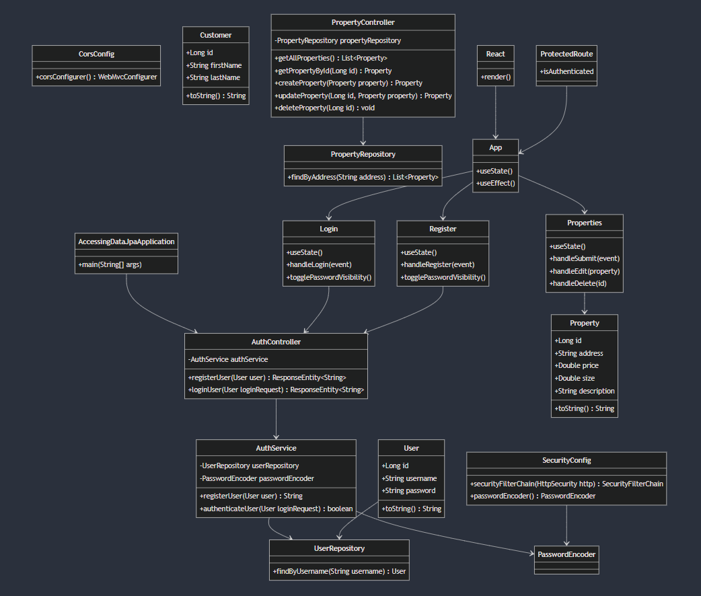

# Property Management Application

A **React + Spring Boot** application for managing properties. This system allows users to register, log in, add, edit, and delete properties, providing a full CRUD experience. The backend is built with Spring Boot, while the frontend is developed using React.

## Table of Contents

- [Features](#features)
- [Tech Stack](#tech-stack)
- [Installation](#installation)
- [Backend Setup](#backend-setup)
- [Frontend Setup](#frontend-setup)
- [Usage](#usage)
- [API Endpoints](#api-endpoints)
- [Project Structure](#project-structure)
- [Contributing](#contributing)
- [License](#license)

## Features

- **User Authentication**: Secure user login and registration.
- **Protected Routes**: Only authenticated users can access certain routes (e.g., property management).
- **CRUD Operations**: Users can create, read, update, and delete properties.
- **Password Encryption**: Passwords are securely stored using encryption.
- **Form Validation**: Real-time form validation to ensure data integrity.
- **Session Management**: User sessions are managed with session storage.
- **Responsive Design**: Optimized for both desktop and mobile devices.

## Tech Stack

### Frontend:
- React
- React Router DOM
- Axios
- Bootstrap
- Font Awesome

### Backend:
- Spring Boot
- Spring Security
- Spring Data JPA
- MySQL (or another relational database)
- JWT for authentication

### Tools:
- Maven
- Docker (Optional)
- Postman (for API testing)

## Installation

### Prerequisites
- **Java 17** or higher
- **Node.js** and **npm**
- **MySQL** or any other relational database
- **Maven**
- **Postman** (optional, for testing)

### Backend Setup

1. **Clone the backend repository**:
    ```bash
    git clone https://github.com/JohannBulls/Jpa.git
    cd Jpa
    ```

2. **Switch to the correct branch**:
    ```bash
    git fetch origin develop
    git checkout develop
    cd Backend
    ```

3. **Set up MySQL using Docker**:
    - Run the following command to start a MySQL container:
      ```bash
      docker run --name mysql-container \
      -e MYSQL_ROOT_PASSWORD=root \
      -e MYSQL_DATABASE=propertydb \
      -e MYSQL_USER=user \
      -e MYSQL_PASSWORD=password \
      -p 3306:3306 -d mysql:8.0
      ```

4. **Configure the database**:
    - Create the MySQL database (if not created by Docker):
      ```sql
      CREATE DATABASE propertydb;
      ```
    - Update the `application.properties` file located in `src/main/resources` with your database credentials:
      ```properties
      spring.datasource.url=jdbc:mysql://localhost:3306/propertydb
      spring.datasource.username=root
      spring.datasource.password=yourpassword
      ```

5. **Run the backend application**:
    - Start the Spring Boot server with Maven:
      ```bash
      mvn spring-boot:run
      ```
    - The backend will be running at `http://localhost:8080`.

---

### Frontend Setup

1. **Navigate to the frontend directory**:
    ```bash
    cd frontend
    ```

2. **Install the dependencies**:
    ```bash
    npm install
    ```

3. **Run the frontend application**:
    ```bash
    npm start
    ```
    - The React app will be available at `http://localhost:3000`.

### AWS Deployment

The project was deployed on AWS using two separate EC2 instances: one for the backend running Spring Boot, and another for the frontend served by Apache. Additionally, HTTPS was configured using an SSL certificate from Let's Encrypt.

1. **Backend Instance**:
   - The backend was deployed on an AWS EC2 instance using Spring Boot and Maven. This instance hosts the REST service of the application.
   - The backend is configured to run on port `8080`, and it is secured to only accept HTTPS requests for better security.
   
   - **Backend access**:  
     The backend can be accessed by the frontend or any client making HTTPS requests at the following URL:  
     `https://apacheaws.duckdns.org`.

2. **Frontend Instance**:
   - The frontend was deployed on another EC2 instance, using an Apache server to serve the React application.
   - Apache was configured to handle HTTPS requests using a **Let's Encrypt** certificate, ensuring that all communications are encrypted.
   - The website is accessible from any device (PC or mobile) at the following URL:  
     `https://apacheaws.duckdns.org`.

3. **HTTPS Certificate**:
   - An SSL certificate was configured for the domain `apacheaws.duckdns.org` using **Let's Encrypt**, making the application available over HTTPS, which adds an additional layer of security.
   
   - Screenshots of the application from different devices:  
      


## Usage

1. **Register** a new user by visiting `http://localhost:3000/register`.
2. **Log in** using your registered credentials.
3. After logging in, you can:
   - View the list of properties.
   - Add a new property.
   - Edit or delete existing properties.
   - Log out from the application.

### API Endpoints

| Endpoint              | Method | Description                          |
| --------------------- | ------ | ------------------------------------ |
| `/auth/register`      | POST   | Register a new user                  |
| `/auth/login`         | POST   | Log in a user                        |
| `/properties`         | GET    | Get all properties                   |
| `/properties/{id}`    | GET    | Get a property by its ID             |
| `/properties`         | POST   | Add a new property                   |
| `/properties/{id}`    | PUT    | Update an existing property          |
| `/properties/{id}`    | DELETE | Delete a property                    |

## Project Structure

(https://mermaid.live/view#pako:eNqlVm1vGjkQ_isrS5UWhUQhCQT4UIm8VL1TeopAaaU7-sGsh8XKYru2N3c0Sn77jfcFvMtuSls-AJ53zzwznmcSSQZkTKKEGnPDaazpei4C_Lx7F1zR6BEEC64dEwySclYmHEyiCIzhIr6hlv6p6ESphEfUcimC51zQfY7WlItwZjVK_vM1oDo2nZz7MhcVe6ldXUthtUwS0L6JY8eagX7iEQR0999zoiHmxoJ-MKBD9xWk-NUJpmCUFAZuheV285qH8eopJjLmYqeVHafwLQVj39ZuiL4M0Q_dWZ2CkoZbqTdZVLujJ3ePRv6Vmt0KVxEdqOr5gKvm0XmCLlOAkWNNoO2GCykToKLxStdSGyzIkseVekZbcqrRaCf4AotPT9GO1GwsNVauq3U9upMiDjjzKPklgiXXxv5F17DPQmt1jpU5L6wmoRbBvZYKtN0cFgFlTCO8PcaNTBcJBEpXkVeQDf_eECwDE2muXE_8crwtPVGyPXCpPZLnNAY7SZJCi4NB53eIo9fSzmtVtiRfbf5gYZGlzjYmHw4aEF8lI9xmuQymUSlVzFcq7HeDw7QZJLCv3QmeZFnJllR6ufJBsOSCXW0mecXDKgCas1SzP4Mo1TwrVb1bTMH6wBPs2euVG4YfrVWlSrDCQ2drwRPzjNSGAZbuvmk81KLK2v0gsLsBIhq7rfT80-itzb39dD8UPsNaDJ1MtWYTH6MPGvsge43kGocyDrb6gzQFGtmKJ43yLl3NE1upijAGMLOIylK8JN4ulxDZFiN3bpr-2MyKCpZAJhzCE8beqSQ0jhMoK_qZG77gCWKhxeW0mP-Hei3lf9vxbnYc6nqWLtbc7jvOubcMedtG32PfZF0eYmO3RWOxLsCmMrWVN_eIm4n39LF9LE0hyfYUs-Jqh6K3Fprj4_e1BaXQqS4tpVhlQfFXAyfw0LAD1GUa-7vhRchkW8Z-1v9tDmsjq9FnLpm3VXYzpYposXUcIQN0lVSirUrdQadyEwcl_wY5M--ptoxv4d8mUAPGNnDSJbh_4DbKcN_N4DIniBKcemSMfxnVj3MyFy8oh5uTnG1ERMZWp9AlWqbxioyXNDF4yh-vYlkuRRQVf0vpH8n4mfxHxheD_slgMBqNLofnl5fDwXm_SzZk3Ls4GfWH_fPh2ah3MbgYnfZeuuR7ZuH0ZHQ26PWGvd6gfzo4uxz2ugSYq92nYll3Py__A4RbyJA)
## License

This project is licensed under the MIT License. See the [LICENSE](LICENSE) file for details.